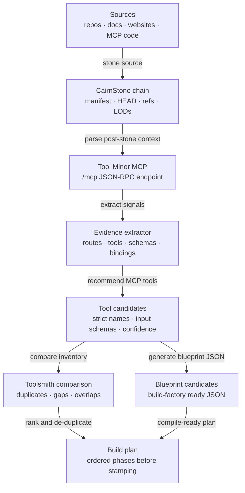

# CairnStone Tool Miner MCP

## Post-Stone Tool Mining Flow



A post-stone MCP that parses CairnStone chains, GitHub repositories, documents, websites, and existing MCP code into strict, evidence-backed MCP tool recommendations.

This repo is intentionally shaped like a post-stone MCP: source intake happens elsewhere, CairnStone provides durable context, and this worker turns that context into tool opportunities, blueprint candidates, and implementation plans.

## Why this exists

CairnStone makes source material persistent and navigable. Tool Miner sits after that step:

```text
source → stone → manifest/HEAD/refs → parse → capabilities → MCP tool candidates → blueprint JSON → factory compile/stamp
```

The goal is not to brainstorm vague ideas. The goal is to emit structured candidate tools with names, input schemas, evidence, confidence, bindings, risk, and build plans.

## Initial MCP tools

| Tool | Purpose |
| --- | --- |
| `parse_source_for_tool_opportunities` | Parse source text/metadata into evidence-backed MCP candidates. |
| `extract_existing_mcp_tools` | Detect existing MCP or JSON-RPC tools already present in a repo/source. |
| `generate_blueprint_candidates` | Convert parsed candidates into build-factory-style blueprint candidates. |
| `score_tool_candidates` | Rank candidates by usefulness, evidence, effort, safety, and duplication risk. |
| `compare_against_toolsmith_inventory` | Compare recommended candidates against existing indexed Toolsmith tools. |
| `create_build_plan` | Produce an ordered build plan for selected candidate tools. |

## Local development

```bash
npm install
npm run typecheck
npm test
```

## Cloudflare Worker

```bash
npm run deploy
```

The worker exposes:

- `GET /health`
- `GET /`
- `POST /mcp`

`POST /mcp` supports basic JSON-RPC MCP-style methods:

- `initialize`
- `tools/list`
- `tools/call`

## Example call

```json
{
  "jsonrpc": "2.0",
  "id": "demo",
  "method": "tools/call",
  "params": {
    "name": "parse_source_for_tool_opportunities",
    "arguments": {
      "source": {
        "type": "cairnstone_chain",
        "name": "contractor-v004-demo",
        "content": "routes: /api/leads /api/status admin panel D1 DB receipts jobs"
      }
    }
  }
}
```

## Design rule

Every recommendation should include evidence. If a tool candidate cannot explain why it exists, it should be scored down or removed.
